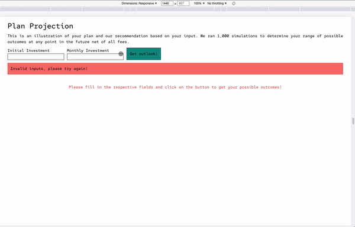

# Table of Contents
- [Project Overview](#overview)
- [Deployment](#deployment)
- [How is the SPA structured?](#structure)
- [Libraries/Technical Stack](#libraries)

# Project Overview <a id="overview"></a>
This project is conducted as part of Endowus' front end challenge. The goal of the challenge is to create an investment plan projection SPA with React.js.

The gif below showcases the final result. I did not host the SPA, however, do feel free to clone the application and run it on your localhost to test it out with the instructions in the "deployment" section.



# Deployment
To deploy the app _locally_, simply run the following commands.
1. ```cd``` into the respective folder.

2. Install the required dependencies by typing the following code into your terminal.
```
npm install
```

3. To start the project.
```
npm run start 
```
[Back to top](#table-of-contents)

<a id='structure'></a>
# How is the SPA structured?
The web page is split into three main components. _(This applies for both mobile and desktop views)_

## [Details](./src/features/details/)

The details section is the topmost part of the web page consisting of the description of the project.

## [Inputs](./src/features/inputs/) 

The inputs section is the middle portion of the web page containing the the fields for user input. This part also contains validation logic to ensure that user input is correct before calling the mock API.

## [Graph](./src/features/graph/) 

The graph section is the final portion of the web page. This portion contains the logic for mapping the data from the API call to render it as a graph. It is also responsible for rendering a spinner while the graph is loading.

It should be noted that the API generated for the graph produces mock data for an initial investment of S$1,000,000 and a monthly investment of S$1,140.

[Back to top](#table-of-contents)

<a id="libraries"></a>

# Libraries/Technical Stack
I experimented with several libraries to help me build this SPA. Here are the libraries and why they were used.

1. Redux Toolkit - State management
2. Highcharts - Graphing
3. react-loader-spinner - Spinner during API call
4. Tailwind CSS - Styling

[Back to top](#table-of-contents)
